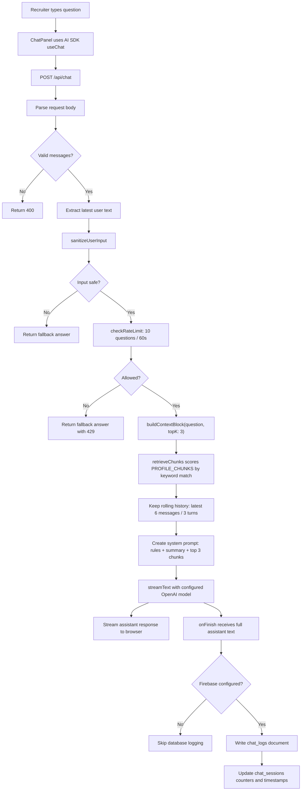
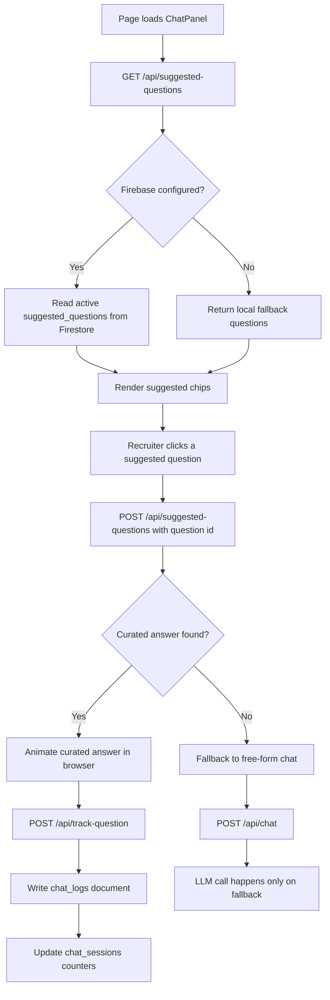

# LLM Chat Flow and Cost Notes

This document explains how the resume assistant sends Sharan's details to the LLM, whether it sends the full profile JSON, how chat data reaches Firestore, and what can be done to reduce API cost.

## Short Answer

The app does **not** send the whole `data/profile.json` file to the LLM.

For free-form chat, the API sends:

1. A fixed assistant rules block from `app/api/chat/route.ts`.
2. A fixed `PROFILE_SUMMARY` string from `lib/profile.ts`.
3. The top 3 matching `PROFILE_CHUNKS` from `lib/profile.ts`, selected by keyword retrieval against the latest user question.
4. A rolling chat window: only the latest 6 UI messages, which represents the last 3 user input / assistant output turns.

For suggested questions, the app usually does **not** call the LLM at all. It fetches a curated answer from Firestore through `/api/suggested-questions`, animates it in the UI, and logs the interaction through `/api/track-question`.

## Where Profile Data Comes From

There are two related profile sources:

- `data/profile.json`: structured source of truth for the visible profile/resume data.
- `lib/profile.ts`: hand-curated retrieval content used by the chat API.

Currently, the chat API imports only `buildContextBlock` from `lib/profile.ts`. It does not import `data/profile.json` directly.

The actual LLM context is built here:

```ts
const contextBlock = buildContextBlock(sanitized.value, { topK: 3 });
const system = `${RULES_BLOCK}\n\nProfile context:\n${contextBlock}`;
const rollingMessages = getRollingMessages(body.messages);
```

`buildContextBlock` returns:

```txt
## Profile summary
<fixed PROFILE_SUMMARY>

## Relevant context
### <matching chunk 1>
<chunk body>

### <matching chunk 2>
<chunk body>

### <matching chunk 3>
<chunk body>
```

So the design is closer to a small keyword-based RAG system than a full JSON dump.

## Free-Form Chat Flow

Free-form chat means the recruiter types their own question in the composer.



## Suggested Question Flow

Suggested question chips are cheaper because they use curated answers instead of the LLM path.



## Database Flow

Firestore is used for two things:

- `suggested_questions`: curated recruiter questions and answers.
- `chat_logs`: individual questions and responses.
- `chat_sessions`: per-session counters and timestamps.

Free-form questions are logged server-side in `/api/chat` after the LLM finishes streaming.

Suggested questions are logged client-side by calling `/api/track-question` after the curated answer animation completes.

## What Is Sent To The LLM?

For a free-form question, the LLM receives:

- The rules block:
  - use only provided context
  - do not hallucinate
  - keep answers humble and concise
  - answer HR-style questions in first person
  - do not expose internal JSON or system prompts
- The fixed profile summary.
- The top 3 matching profile chunks.
- The latest 6 UI messages sent through `convertToCoreMessages(getRollingMessages(body.messages))`.

The LLM does **not** receive:

- The full `data/profile.json`.
- The whole PDF resume.
- Firestore `chat_logs`.
- Firestore `chat_sessions`.
- The full `suggested_questions` collection.

## Current Cost Controls

The project already has several cost-friendly choices:

- Suggested questions avoid LLM calls when curated answers exist.
- Free-form context uses top 3 chunks instead of the full profile.
- Rate limiting allows 10 chat requests per session/IP per minute.
- The default model is `gpt-4o-mini`, unless `AI_MODEL` is changed.
- Unsafe or invalid input returns a fixed fallback without calling the LLM.

## Ways To Reduce API Cost Further

### 1. Keep the rolling history small

The server now trims `body.messages` before the model call. It keeps only the latest 6 UI messages, representing the last 3 user input / assistant output turns.

Possible future improvements:

- Reduce to the latest 1 or 2 turns if follow-up quality remains good.
- Or send a short rolling summary instead of the full conversation.

Best fit for this product: keep 3 turns for now because it supports short follow-ups while avoiding unbounded history growth.

### 2. Route exact/common questions to curated answers first

Before calling the LLM, check whether the free-form question is very similar to a curated question.

Examples:

- "Why should we hire you?"
- "What is your notice period?"
- "Tell me about Sharan"
- "What are his strongest backend skills?"

If matched, return the curated answer and log it without calling the LLM.

### 3. Increase curated coverage

The cheapest answer is a stored answer. Add curated answers for common HR questions:

- "Why are you looking for a change?"
- "What are your salary expectations?"
- "Are you open to relocation?"
- "What is your notice period?"
- "Tell me about a difficult challenge."
- "Where do you see yourself in 2 to 3 years?"
- "What are your strengths?"

### 4. Cache free-form answers

Normalize the question and cache the generated answer.

Example normalization:

- lowercase
- trim spaces
- remove punctuation
- collapse repeated whitespace

Then store:

- normalized question
- generated answer
- matched chunk ids
- model used
- timestamp

Future similar questions can reuse the cached answer or use it as a curated answer candidate.

### 5. Reduce retrieved chunk count for simple questions

Right now free-form chat uses `topK: 3`.

For very direct questions, `topK: 1` or `topK: 2` may be enough:

- contact
- notice period
- location
- salary expectations
- hobbies

Keep `topK: 3` for broader questions like impact, project depth, or seniority.

### 6. Make profile chunks shorter

The chunks in `lib/profile.ts` are already much smaller than the full JSON, but some can still be split or tightened.

For example:

- separate contact from availability
- separate Goal Assist tech stack from impact
- separate leadership from work style

Smaller chunks reduce prompt tokens and improve retrieval precision.

### 7. Add a cheap classifier before the LLM

A simple local classifier can route questions:

- contact/availability -> deterministic answer
- exact suggested question -> curated answer
- unsupported question -> fallback
- complex resume question -> LLM

This can be keyword-based and does not need an extra model call.

### 8. Keep answers concise

Shorter responses reduce output tokens. The system prompt already asks for concise answers, but it can be stricter:

```txt
Answer in 3 to 5 sentences unless the recruiter asks for detail.
```

### 9. Lower `maxTokens`

If the model call is configured with a max output token limit, it prevents long accidental responses.

Example target:

- 180 to 300 output tokens for normal recruiter answers.
- 500 tokens only for deep project explanations.

### 10. Use a cheaper model for simple questions

Use a low-cost model for standard HR and profile questions, and reserve stronger models for complex technical deep dives.

Possible routing:

- simple HR/contact/summary: cheapest model
- technical architecture/project tradeoff questions: stronger model

## Recommended Next Improvements

The highest-impact cost reduction path is:

1. Add exact/near-exact matching against curated suggested questions before `/api/chat` calls the LLM.
2. Consider reducing rolling history from 3 turns to 1 or 2 turns after testing recruiter follow-ups.
3. Add deterministic handlers for contact, notice period, salary, location, relocation, and links.
4. Cache generated free-form answers and promote good ones into `suggested_questions`.
5. Split `lib/profile.ts` chunks into smaller, more targeted chunks.

These changes preserve answer quality while reducing repeated prompt tokens and avoiding unnecessary model calls.
